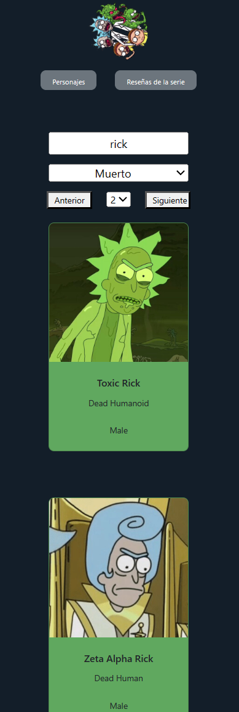
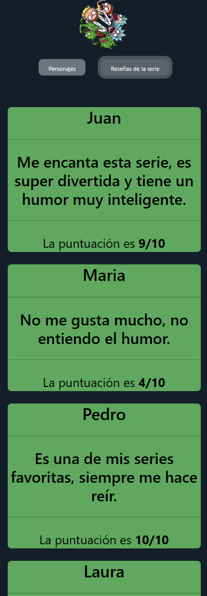

*Figura 1: Logo del proyecto*

# Proyecto Rick y Morty

Este proyecto fue creado con `create-react-app` y utiliza la API de Rick y Morty para mostrar información sobre los personajes de la serie.

## Descripción

El objetivo de este proyecto es explorar el uso de React y la integración con una API externa para mostrar información relevante sobre los personajes de Rick y Morty.

## Funcionalidades

- **Búsqueda de Personajes:** Utiliza un componente de búsqueda para filtrar los personajes por nombre.
- **Filtrado por Estado:** Permite filtrar los personajes por su estado (vivo, muerto, desconocido).
- **Paginación:** Muestra los resultados paginados para facilitar la navegación.

## Tecnologías Utilizadas

- React
- Bootstrap para el estilo
- React Router para la navegación entre páginas

## Instrucciones de Uso

1. Clona este repositorio.
2. Ejecuta `npm install` para instalar las dependencias.
3. Ejecuta `npm install react-bootstrap bootstrap` para instalar bootstrap.
4. Ejecuta `npm install react-router-dom` para instalar las dependencias de React-Router.
5. Ejecuta `npm start` para iniciar la aplicación en modo desarrollo.

## Capturas de Pantalla

En estas capturas podemos ver que tiene un diseño responsive en ambas páginas del proyecto.

## Contribuciones

Las contribuciones son bienvenidas. Si encuentras algún error o tienes una mejora, ¡siéntete libre de abrir un problema o enviar un pull request!

## Estado del Proyecto

## Licencia

Este proyecto está bajo la licencia [MIT](LICENSE).

